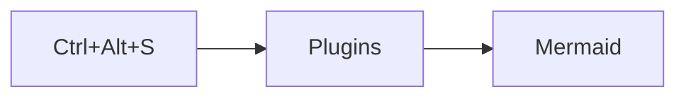
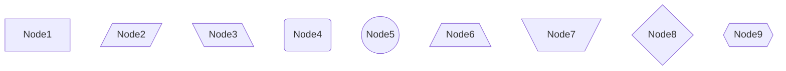
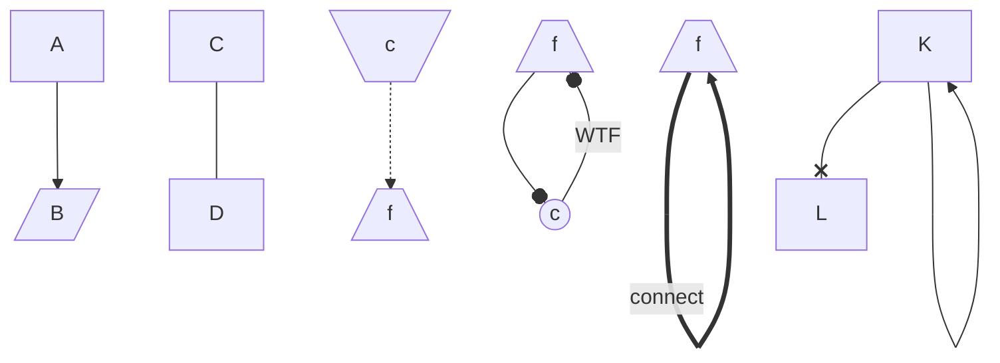
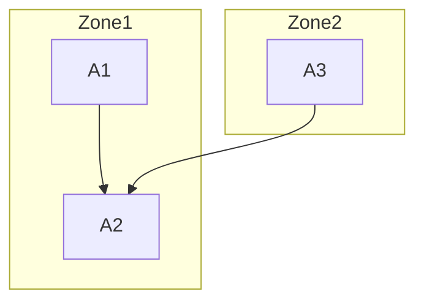
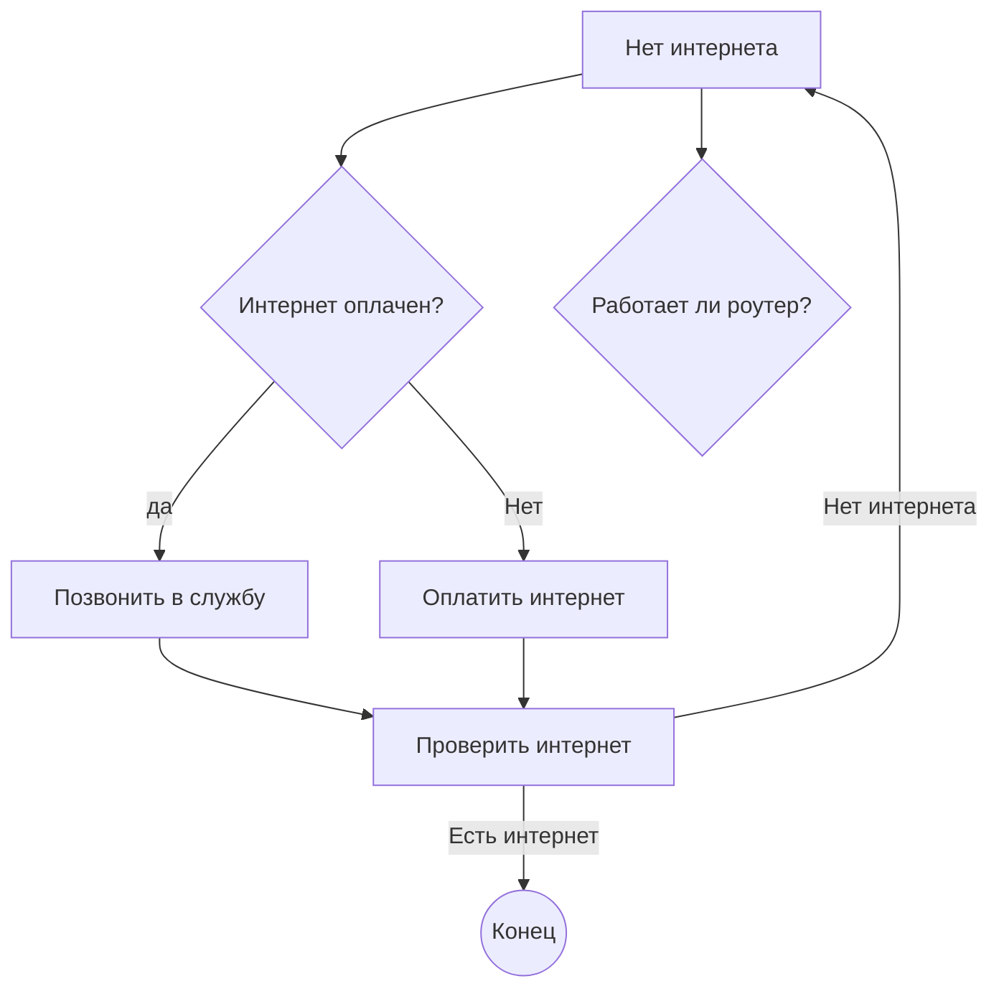
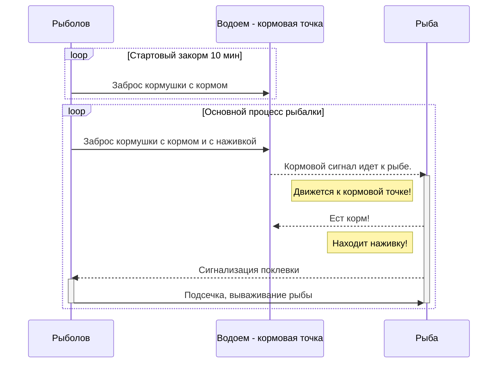

# Как строить диаграммы?  Шпаргалка
## Установка плагинов в Pycharm для работы с Mermaid
Если плагины не установленны, нужно нажать 

## Базовый блок
```
В тексте прописываем блок
    ```mermaid
        И в данном блоке описываем диаграмму
    ```
```
## Узлы
```
 Команды для создания узлов:
     flowchart TB
         node1[Node1]
         node2[/Node2/]
         node3[\Node3\]
         node4(Node4)
         node5((Node5))
         node6[/Node6\]
         node7[\Node7/]
         node8{Node8}
         node9{{Node9}}
         
    TB — «top to bottom», сверху вниз;
    TD — «top-down/ same as top to bottom», сверху вниз;
    BT — «bottom to top», снизу вверх;
    RL — «right to left», справа налево;
    LR — «left to right», слева направо.
```

## Стрелки между узлами
```
  Команды для создания стрелок:  
    flowchart TB
        node1[А] --> node2[/B/]
        C --- D
        node3[\c/] -.-> node4[/f\]
        node5[\c/] ==> node5[/f\]
        node6((c)) --o node7[/f\]
        node7((c)) --o node6[/f\]
        K --x L
        K --> K
```

## Подграфы
Используются для визуального объединения.
```

```



## Примеры
### Ремонт интернета)))





Полезная ссылки , где еще больше кайфов, от доброго человека.
https://habr.com/ru/articles/652867/
https://mermaid.js.org/syntax/sequenceDiagram.html


